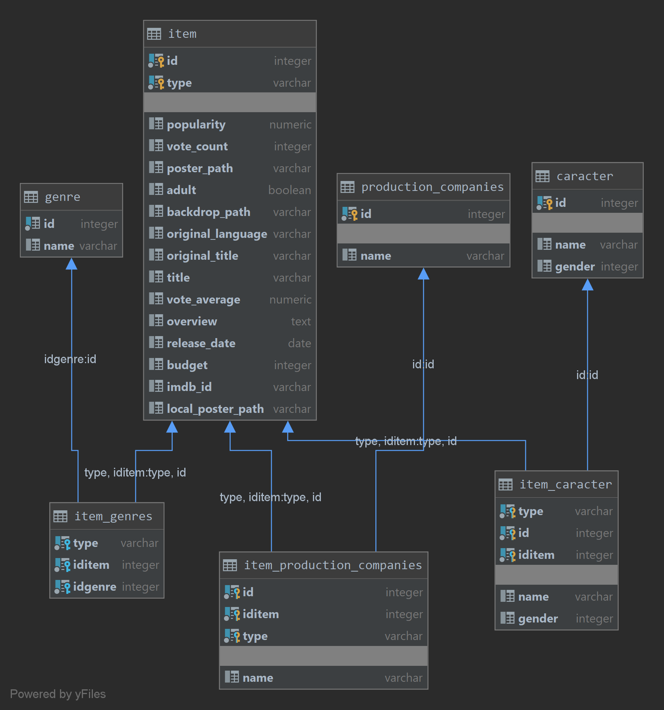

# Creación del modelo relacional de la base de datos
Una vez montado el contenedor con el entorno Postgre SQL solo tendríamos que crear las tablas necesarias en la misma base de datos que se creó en el Dockerfile.

## Diagrama

## Script creación BBDD
Aquí esta el script de creación de las tablas [Script](script.sql)