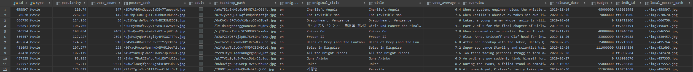
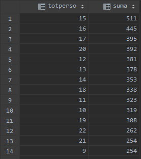
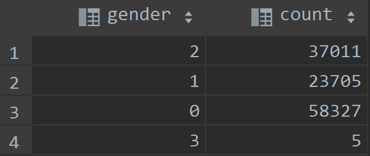
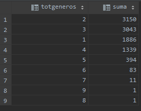
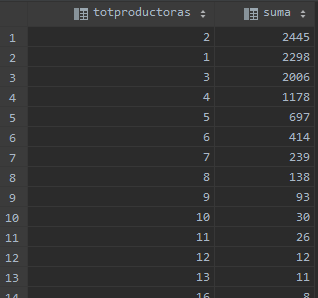

# Creación dataset a partir de los datos obtenidos
Hemos obtenidos una serie de datos, almacenados en varias tablas de una base de datos relacional dockerizada con motor Postgre SQL. Los datos han sido obtenido haciendo llamadas a una API y también scrapeándolos de una web.

Llega el momento de generar un único dataset con todos esos datos. Tenemos varias tablas, pero nuestra tabla principal es **item**, en este momento la tabla se muestra tal que así:



Tenemos varias tablas que complementan esta anterior:
- **item_caracter**: Actores de cada película.
- **item_genre**: Géneros a los que pertenece la película.
- **item_production_companies**: Compañías productora de la película.

Para cada una de estas tres tablas anteriores tenemos también su tabla "padre" que contiene registros únicos.

Estas tres tablas que complementan la información de la tabla **item** contienen información relevante, porque el éxito de una película puede perfectamente depender de los actores que participan o de la productora que la lleva a cabo. Pero tienen más de un registro por cada registro de la tabla **item**, y no podemos genrar una columna para cada uno, así que analizaré la información que contienen con sentencias SQL y crearé las columnas pertinentes.

## Tabla principal 🎬
Generamos la tabla principal partiendo de la tabla **item** y nos quedamos solo con las películas:
```
SELECT * INTO table dataset_final FROM item WHERE type = 'Movie';
```

## Actores 🎭
Vamos a contar cuántos actores/actrices aparecen en cada película y generaremos tantas columnas en nuestro dataset como resultados nos de ese cálculo, las columnas serían (actor1, actor2, ... actorN) y para cada registro de la tabla principal pondremos sus N actores en esas nuevas columnas.
```
-- Contamos la suma de actores que participan en una película y observamos el total de películas por cada suma de actores
SELECT totPerso, COUNT(totPerso) suma FROM
    (SELECT iditem, COUNT(*) totPerso FROM item_caracter WHERE type = 'Movie' GROUP BY iditem) T2
GROUP BY totPerso ORDER BY suma DESC;
```

La consulta nos da estos resultados:



Vemos que de las 10000 películas 511 tienen 15 actores, 445 tienen 16 actores, esto no nos sirve para obtener un número de columnas porque los resultados son muy dispares, calculamos la media de actores por película y ese será el nº de columnas que generaremos en el dataset:

```
-- Media de actores en una película
SELECT (actores_totales / total_peliculas) media FROM (
      SELECT (
                 SELECT SUM(tot_actores) actores_totales
                 FROM (
                          SELECT iditem, COUNT(*) AS tot_actores
                          FROM item_caracter
                          WHERE type = 'Movie'
                          GROUP BY iditem
                      ) T2
             ),
             (
                 SELECT COUNT(*) total_peliculas
                 FROM (
                          SELECT iditem, COUNT(*) AS tot_actores
                          FROM item_caracter
                          WHERE type = 'Movie'
                          GROUP BY iditem
                      ) T1
             )
) T3;
```

El resultado de la consulta nos da:
```
24.8885636418693853
```

Por lo que generaremos 28 columnas para los actores.

En la tabla de actores también tenemos el género (sexo del actor), un número entero que va de 0 a 3, aunque según la API el número máximo es 2, viendo los datos, esos actores son solo 5 de 119043 registros:



Para los sexos, también crearemos 28 columnas, para poder especificar el sexo de cada uno de los actores.

## Géneros 📽
Para los géneros, hacemos lo mismo que con los actores, comprobamos primero si el número de géneros por película está estandarizado:
```
SELECT totGeneros, COUNT(totGeneros) suma FROM
    (SELECT iditem, COUNT(*) totGeneros FROM item_genres WHERE type = 'Movie' GROUP BY iditem) T2
GROUP BY totGeneros ORDER BY suma DESC;
```
La consulta da estos resultados:



Vemos que la mayor parte está entre 2 y 3 géneros por película, por lo que generaremos 2 nuevas columnas.

## Productoras 🏢
Repetimos el proceso para las productoras:
```
SELECT totProductoras, COUNT(totProductoras) suma FROM
    (SELECT iditem, COUNT(*) totProductoras FROM item_production_companies WHERE type = 'Movie' GROUP BY iditem) T2
GROUP BY totProductoras ORDER BY suma DESC;
```
La consulta da estos resultados:



Vemos que la media también estaría entre 2 y 3 productoras por película, por lo que generaremos 2 nuevas columnas.

## Scripts creación de campos 📐
Este sería el script para crear los nuevos campos en la tabla del dataset final:
```
/*##################################################################################################################
                                                INICIO ACTORES
##################################################################################################################*/
alter table dataset_final
	add actor1 varchar;

alter table dataset_final
	add actor2 varchar;

alter table dataset_final
	add actor3 varchar;

alter table dataset_final
	add actor4 varchar;

alter table dataset_final
	add actor5 varchar;

alter table dataset_final
	add actor6 varchar;

alter table dataset_final
	add actor7 varchar;

alter table dataset_final
	add actor8 varchar;

alter table dataset_final
	add actor9 varchar;

alter table dataset_final
	add actor10 varchar;

alter table dataset_final
	add actor11 varchar;

alter table dataset_final
	add actor12 varchar;

alter table dataset_final
	add actor13 varchar;

alter table dataset_final
	add actor14 varchar;

alter table dataset_final
	add actor15 varchar;

alter table dataset_final
	add actor16 varchar;

alter table dataset_final
	add actor17 varchar;

alter table dataset_final
	add actor18 varchar;

alter table dataset_final
	add actor19 varchar;

alter table dataset_final
	add actor20 varchar;

alter table dataset_final
	add actor21 varchar;

alter table dataset_final
	add actor22 varchar;

alter table dataset_final
	add actor23 varchar;

alter table dataset_final
	add actor24 varchar;

alter table dataset_final
	add actor25 varchar;

alter table dataset_final
	add actor26 varchar;

alter table dataset_final
	add actor27 varchar;

alter table dataset_final
	add actor28 varchar;
/*##################################################################################################################
                                                FIN ACTORES
##################################################################################################################*/

/*##################################################################################################################
                                            INICIO GÉNEROS ACTORES
##################################################################################################################*/
alter table dataset_final
	add genero_actor1 int;

alter table dataset_final
	add genero_actor2 int;

alter table dataset_final
	add genero_actor3 int;

alter table dataset_final
	add genero_actor4 int;

alter table dataset_final
	add genero_actor5 int;

alter table dataset_final
	add genero_actor6 int;

alter table dataset_final
	add genero_actor7 int;

alter table dataset_final
	add genero_actor8 int;

alter table dataset_final
	add genero_actor9 int;

alter table dataset_final
	add genero_actor10 int;

alter table dataset_final
	add genero_actor11 int;

alter table dataset_final
	add genero_actor12 int;

alter table dataset_final
	add genero_actor13 int;

alter table dataset_final
	add genero_actor14 int;

alter table dataset_final
	add genero_actor15 int;

alter table dataset_final
	add genero_actor16 int;

alter table dataset_final
	add genero_actor17 int;

alter table dataset_final
	add genero_actor18 int;

alter table dataset_final
	add genero_actor19 int;

alter table dataset_final
	add genero_actor20 int;

alter table dataset_final
	add genero_actor21 int;

alter table dataset_final
	add genero_actor22 int;

alter table dataset_final
	add genero_actor23 int;

alter table dataset_final
	add genero_actor24 int;

alter table dataset_final
	add genero_actor25 int;

alter table dataset_final
	add genero_actor26 int;

alter table dataset_final
	add genero_actor27 int;

alter table dataset_final
	add genero_actor28 int;
/*##################################################################################################################
                                            FIN GÉNEROS ACTORES
##################################################################################################################*/

/*##################################################################################################################
                                            INICIO GÉNEROS PELÍCULAS
##################################################################################################################*/
alter table dataset_final
	add genero1 varchar;

alter table dataset_final
	add genero2 varchar;
/*##################################################################################################################
                                            FIN GÉNEROS PELÍCULAS
##################################################################################################################*/

/*##################################################################################################################
                                            INICIO PRODUCTORAS
##################################################################################################################*/
alter table dataset_final
	add productora1 varchar;

alter table dataset_final
	add productora2 varchar;
/*##################################################################################################################
                                            FIN PRODUCTORAS
##################################################################################################################*/
```

## Rellenar los nuevos campos 🖊
Para rellenar los nuevos campos vamos a usar un script en Python porque facilita más el hacer condiciones y bucles con los datos.

## Aclaración 💡
No podemos tratar los actores, géneros o productoras como variables categóricas y hacer un One-Hot Encoding porque tenemos varios miles de registros por cada una de esas tres tablas, acabaríamos con un dataset con miles de columnas inutilizable.